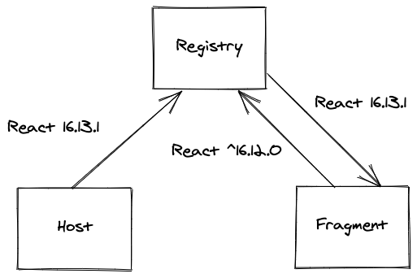

# registry

Allows sharing dependencies between micro frontends.

# Introduction

With the arrival of micro frontends, one of the main challenges is sharing
dependencies to avoid making websites too big.

This library tries to take up this challenge thanks to **semantic versioning**
which allows providing ranges of versions instead of fixed versions which brings
flexibility.

<p align="center">
  
</p>

# Install

```bash
npm install --dev @josselinbuils/registry
yarn add -D @josselinbuils/registry
```

# Usage

## Host

### Webpack config

Add the **RegistryWebpackPlugin** to your **Webpack** config file:

```javascript
// webpack.config.js

const { RegistryWebpackPlugin } = require('@josselinbuils/registry/plugin');

modules.exports = {
  // [...]
  plugins: [
    new RegistryWebpackPlugin({
      sharedDependencies: ['react', 'react-dom'],
    }),
  ],
};
```

### App

Initialize the registry as soon as possible in your host app:

```javascript
// index.js

import { initRegistry } from '@josselinbuils/registry';

initRegistry();
```

## Fragments

### Webpack config

Add the **RegistryWebpackPlugin** to your **Webpack** config file:

```javascript
// webpack.config.js

const { RegistryWebpackPlugin } = require('@josselinbuils/registry/plugin');

modules.exports = {
  // [...]
  plugins: [
    new RegistryWebpackPlugin({
      externalDependencies: ['react', 'react-dom'],
    }),
  ],
};
```

### App

Initialize the registry before importing any shared dependency in your fragments:

```javascript
// index.js

import { initRegistry } from '@josselinbuils/registry';

const { awaitExternalDependencies } = initRegistry();

awaitExternalDependencies().then(() => {
  import('./render');
});
```

## Examples

You can find a working example in **examples/basic** folder.
