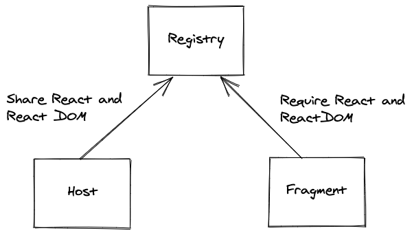

# Basic example

  

This example shows how to share dependencies between a host and a fragment
loaded on the host.

Start the host, the fragment and open your browser at http://localhost:3000.

You can display the content of `window.registry` in your browser console to see
what dependencies have been loaded.
